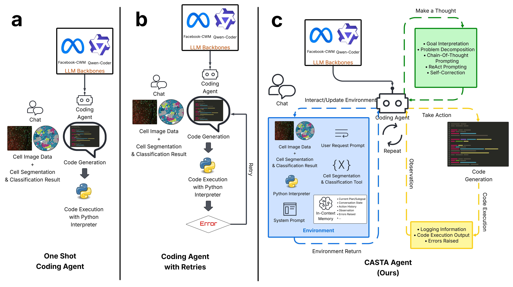
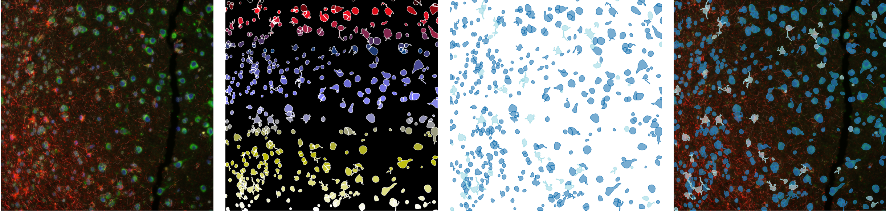
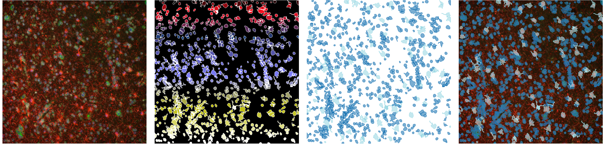
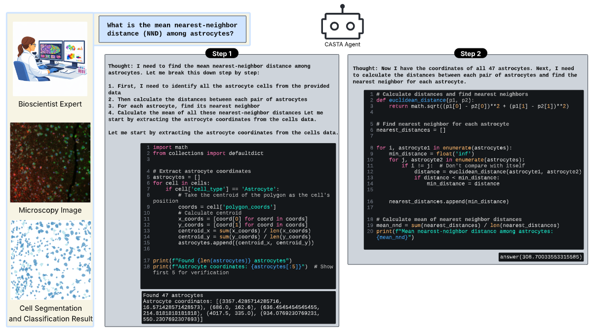

# TissueCodePilot: A Code-Action Agent for AI-Assisted Spatial Tissue Analysis

> **Note:** The code and dataset for this project are still being prepared and have not been fully released yet. Please stay tuned!

## Abstract
Spatial tissue image analysis is essential for quantifying cellular microenvironments and tissue architecture. Yet existing software typically exposes a fixed feature set, which may limit biomarker discovery. When required features are missing, bioscientists may require collaboration with computational experts, which can introduce delays and limit scalability. To address these limitations, we propose \textbf{TissueCodePilot}, a coding-and-reasoning agent that observes relevant information from the analysis environment and autonomously plans and executes actions to support flexible, on-demand spatial tissue analysis. Unlike prior coding agents that rely on detailed, iterative prompting, TissueCodePilot requires only a single minimal user prompt, making it accessible to bioscientists without extensive programming experience. To evaluate TissueCodePilot, we curate an expert-annotated dataset spanning three tissue types with multiple fields of view per tissue. Each field of view is paired with 50 questions that provide minimal prompt context and cover diverse spatial feature categories. In total, the dataset comprises 1{,}500 image–question pairs with corresponding ground-truth outputs. We will publicly release this benchmark to support future research as the first coding-agent benchmark for spatial tissue image analysis. On this new benchmark, TissueCodePilot substantially outperforms prompt-instruction coding agent baselines, boosting Success Rate from $\sim$0-2.4\% to 18.5-35.4\%, increasing pass@5 from at most 11.61\% to 54.82-75.05\%, and increasing pass@10 from at most 22.48\% to 64.00–86.00\%.

## Main figure


## Sample Microsocpy image + Cell Segmentation/Classification Results
Sample #1:

Sample #2:


## Spatial Analysis Questions
>
> - **Mean epithelial–immune nearest-neighbor distance**  
>   What is the mean nearest-neighbor distance from epithelial cells to the closest other immune cell (non‑T) within the FOV?
>
> - **T-cell overlap with epithelial clusters**  
>   What fraction of T-cell centroids lie within merged epithelial-cluster polygons?
>
> - **Astrocyte to non-astrocyte ratio**  
>   What is the astrocyte-to-non-astrocyte ratio within the entire FOV?
>
> - **Astrocyte nearest-neighbor variability**  
>   What is the coefficient of variation (CV) of astrocyte nearest-neighbor distances?
>
> - **Spatial evenness of astrocytes**  
>   What is the spatial Pielou’s evenness of astrocytes across a 10×10 grid over the FOV?
>
> - **Macrophage clustering distance**  
>   What is the mean nearest-neighbor distance between macrophages (macrophage-to-macrophage) within the FOV?

## Sample Run figure



### Quantitative comparison of CASTA with prompt-instruction (PI) coding-agent baselines

Values are formatted as: Success Rate | pass@5 / pass@10

| Model | Dataset | PI (1-shot) | PI (w/ Retries) | PI-CoT (1-shot) | PI-CoT (w/ Retries) | PI-CoT Few-Shot (1-shot) | PI-CoT Few-Shot (w/ Retries) | CASTA Agent (Ours) |
|------|------|------|------|------|------|------|------|------|
| Qwen3-Coder-30B-A3B-Instruct (~30B params) | Frontal Cortex | 1.60 \| 6.83/12.00 | 1.70 \| 8.29/16.07 | 0.83 \| 5.83/10.00 | 1.28 \| 6.40/12.61 | 2.20 \| 9.39/16.00 | 2.40 \| 11.61/22.48 | **28.20 \| 60.35/70.00** |
| Qwen3-Coder-30B-A3B-Instruct (~30B params) | NSCLC | 1.40 \| 6.56/12.00 | 1.47 \| 7.39/14.60 | 2.00 \| 8.39/14.00 | 1.89 \| 9.35/18.20 | 1.40 \| 6.56/12.00 | 1.50 \| 7.43/14.52 | **35.40 \| 75.05/86.00** |
| Qwen3-Coder-30B-A3B-Instruct (~30B params) | Pancreas | 1.25 \| 4.82/6.00 | 1.51 \| 7.45/14.40 | 0.50 \| 2.50/4.00 | 0.89 \| 4.53/8.94 | 1.25 \| 5.54/8.00 | 1.49 \| 7.39/14.56 | **30.19 \| 59.37/64.00** |


## Citation
```
@InProceedings{VoHun_TissueCodePilot_MICCAI2026,
        author = { Vo, Hung Q. AND Vo, Huy Q. AND Zhao, Hong AND Wong, Stephen T. C. AND Nguyen, Hien V.},
        title = { { TissueCodePilot: A Code-Action Agent for AI-Assisted Spatial Tissue Analysis } },
        booktitle = {Medical Image Computing and Computer Assisted Intervention -- MICCAI 2026},
        year = {2026},
        publisher = {Springer Nature Switzerland},
        volume = {LNCS 16891},
        month = {September},
        page = {pending}
}
```

## Acknowledgements

This project builds on several outstanding contributions from the open‑source LLM community. We thank the teams and researchers behind the following projects:

- **ReAct (Reasoning and Acting)** — Prompting framework combining reasoning and tool use in language models  
  https://arxiv.org/abs/2210.03629

- **CodeAct** — Executable code actions elicit better LLM agents  
  https://arxiv.org/abs/2402.01030

- **vLLM** — High‑throughput and memory‑efficient LLM inference engine  
  https://github.com/vllm-project/vllm

- **SGLang** — Framework for fast, structured LLM programming and serving  
  https://github.com/sgl-project/sglang
